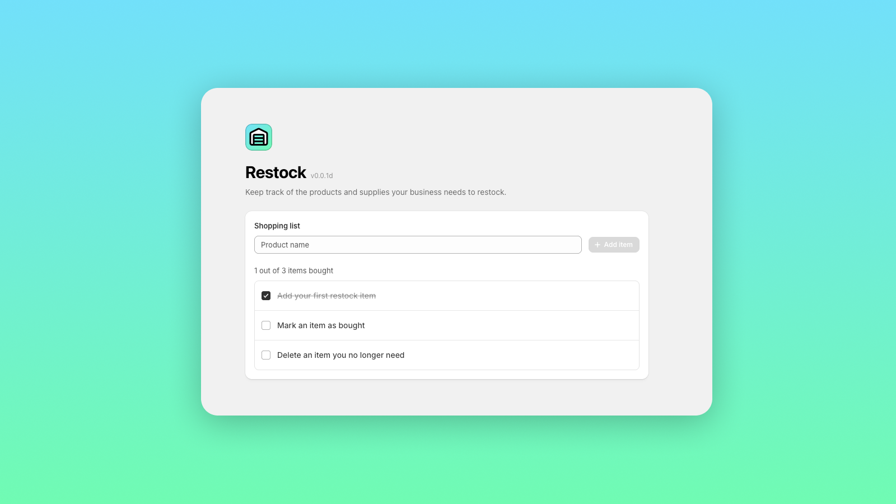

<p align="center">
  
</p>

<h3 align="center">Restock</h3>

<p align="center">
  Keep track of the products and supplies your business needs to restock.
  <br />
  A lightweight merchant shopping list built with React, Express, and MongoDB.
</p>

<p align="center">
  <a href="./LICENSE">
    
  </a>
</p>

<br />

<p align="center">
  
</p>

## Features

- Add items, mark them as bought, and delete them
- Persist items across sessions with MongoDB
- Use the list across desktop and mobile screen sizes

## Quick start

Local setup requires Node.js 24 or newer, pnpm 11.15.0, and Docker with Docker Compose. Run from the repository root:

```sh
pnpm install
cp apps/api/.env.template apps/api/.env.local
pnpm --filter @repo/api db:local:start
pnpm exec turbo run start:dev
```

Open [http://localhost:3000](http://localhost:3000). The API runs at [http://localhost:8787](http://localhost:8787).

## Development

The workspace contains two applications:

| Package                           | Purpose                         | Local URL                                      |
| --------------------------------- | ------------------------------- | ---------------------------------------------- |
| [`@repo/web`](apps/web/README.md) | React frontend                  | [localhost:3000](http://localhost:3000)        |
| [`@repo/api`](apps/api/README.md) | Express API and Mongoose models | [localhost:8787](http://localhost:8787/health) |

Run the applications from the root in separate terminals:

```sh
# Terminal 1
pnpm --filter @repo/api start:dev

# Terminal 2
pnpm --filter @repo/web start:dev
```

Stop the web app and API with `Ctrl+C`. Stop MongoDB separately:

```sh
pnpm --filter @repo/api db:local:stop
```

The Docker volume preserves data between container restarts.

### Configuration

| File                  | Variable          | Template value                      | Purpose                 |
| --------------------- | ----------------- | ----------------------------------- | ----------------------- |
| `apps/api/.env.local` | `MONGODB_URI`     | `mongodb://127.0.0.1:27017/restock` | MongoDB connection      |
| `apps/api/.env.local` | `API_CORS_ORIGIN` | `http://localhost:3000`             | Allowed frontend origin |
| `apps/web/.env.local` | `API_URL`         | `http://127.0.0.1:8787`             | API base URL            |

`MONGODB_URI` is required. The other variables are optional. To use MongoDB Atlas, set an Atlas `mongodb+srv://` connection string and skip `db:local:start`.

## Tech stack

- **Frontend:** React, TypeScript, TanStack Start, TanStack Router
- **UI:** Shopify Polaris web components, Tailwind CSS, canvas-confetti
- **Backend:** Express, TypeScript
- **Database:** MongoDB, Mongoose
- **State:** feature-state, feature-react
- **Tools:** pnpm, Turborepo, ESLint, Prettier

Shopify Polaris web components load from Shopify's CDN at runtime.

## API

| Method   | Path         | Request body           | Result                                     |
| -------- | ------------ | ---------------------- | ------------------------------------------ |
| `GET`    | `/items`     | None                   | Returns all shopping items                 |
| `POST`   | `/items`     | `{ "name": "Butter" }` | Creates a shopping item                    |
| `PUT`    | `/items/:id` | `{ "bought": true }`   | Updates the bought status                  |
| `DELETE` | `/items/:id` | None                   | Deletes a shopping item                    |
| `GET`    | `/health`    | None                   | Returns API health and version information |

## Validation

Run the repository checks from the root:

```sh
pnpm lint
pnpm build
```

## License

Restock is open source under the **GNU Affero General Public License v3.0 (AGPL v3)**.

See [LICENSE](./LICENSE) for the full license text.
